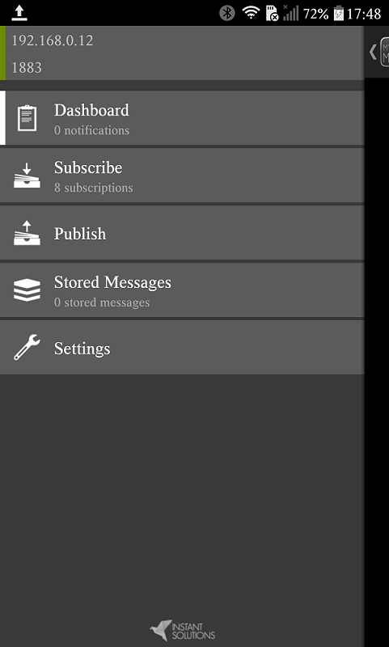

# Relatório do projeto         

# 1 - Objetivo do projeto:       
 - Projeto de um módulo de irrigação composto por duas partes:        
	- Um **módulo de irrigação**, que:     
		- Mensura a umidade do solo por meio de um sensor higrômetro.    
		- Controla uma válvula solenóide que irriga a água bombeada para o solo.    
	- Um **módulo de controle de bomba**:     
		- Mensura o nível de água no reservatório (ou caixa d'água) onde está armazenada a água que irá ser usada para a irrigação.     
		- Controla uma bomba d'água, que somente irá funcionar quando houver água no reservatório.     
		

# 2 - Diagramas Esquemáticos dos circuitos dos módulos Irrigação e Bomba:       
      

## 2.1 - Módulo **Irrigação**:          
 - **Componentes**:      
	- NodeMCU-ESP8266.   
	- Sensor de umidade de solo (higrômetro), modelo FC-28    
		- Módulo Amplificador.    
		- Pontas.      
	- Módulo relé 5V.     
	- Válvula solenoide.       
	- Display LCD 16x2, com módulo I²C (módulo com o chip PCF8574).     
       

### 2.1.1 - Diagrama esquemático:        
         
        

### 2.1.2 - Circuito montado na Protoboard       
         
      

## 2.2 - Módulo **Bomba**:          
 - **Componentes**:      
	- NodeMCU-ESP8266.   
	- Sensor de nível de água.      
	- Conversor de nível lógico bidirecional (3.3V-5V).      
	- Módulo relé 5V.     
	- Bomba (ou motor de bombeamento) d'água.            
	- Display LCD 16x2, com módulo I²C (módulo com o chip PCF8574).     
       

### 2.2.1 - Diagrama esquemático:        
         
        

### 2.3.2 - Circuito montado na Protoboard       
         
      

# 3 - Tópicos com os dados publicados:            
       

## 3.1 - Os tópicos com os dados publicados pelos módulos do sistema:       
 - **`param/UmidadeMaxima`**:      
	- Percentual máximo de umidade do solo.      
	- Quando o sensor de umidade de solo detectar que a umidade do solo atingiu esse percentual, ele irá cessar a irrigação.     
 - **`param/UmidadeMinima`**:       
	- Percentual mínimo de umidade do solo.      
	- Quando o sensor de umidade de solo detectar que um percentual de umidade do solo menor que esse patamar, o sistema irá ativar a irrigação.         
 - **`irrigacao/Umidade`**: Umidade do solo, já na forma de número percentual (não precisa multiplicar por 100), detectada pelo higrômetro do sensor de umidade de solo.            
 - **`irrigacao/EstadoSolenoide`**: Valor **`0` ou `1`** indicando se a válvula **solenóide está ligada ou não**.            
 - **`irrigacao/EventosSolenoide`**: String com vários valores separados por **`,`**, relacionados com os eventos ocorridos na solenóide:       
	- Data em que o evento ocorreu.      
	- Hora do evento na data indicada.         
	- Valor binário (`0` ou `1`) indicando o estado da solenoide     
	- Evento ocorrido na solenoide (`Ligar`, `Desligar` ou `Nao_Ligar`).       
	- Fato que gerou o evento em questão.    
 - **`bomba/NivelAgua`**: Valor entre 0 e 2 - **`0`**, **`1`** ou **`2`** - indicando o nível de água no reservatório.             
	- Esses valores representam uma escala ordinal, onde 0 significa que o reservatório está vazio e 2 cheio.     
	- A solenoide e a bomba somente serão ativadas quando esse valor for igual a 2.     
 - **`bomba/EstadoBomba`**: Valor **`0` ou `1`** indicando se a **bomba está ligada ou não**.       
 - **`bomba/EventosBomba`**:     
	- Data em que o evento ocorreu.      
	- Hora do evento na data indicada.         
	- Valor binário (`0` ou `1`) indicando o estado da bomba.     
	- Evento ocorrido na bomba (`Ligar` ou `Desligar`).       
	- Fato que gerou o evento em questão.     
 - **`geral/SerieDadosIrrigacao`**:       
	- Data dos dados.      
	- Hora dos dados.       
	- Valor binário (0 ou 1) indicando se a solenóide está ligada ou desligada.      
	- Umidade do solo, em valor percentual, mensurada pelo sensor.      
	- Percentual mínimo de umidade do solo.     
	- Percentual máximo de umidade do solo.   
 - **`geral/SerieDadosBomba`**: String com vários valores separados por **`,`**, composta por:      
	- Data dos dados      
	- Hora dos dados       
	- Valor ADC lido no pino analógico do NodeMCU.      
	- String indicando o nível da água no reservatório (`Vazio = 0` ou `Baixo = 1` ou `Alto = 2`)       
	- Valor de 0 a 2 com o nível de água no reservatório.      
	- Valor binário indicando se a bomba está ligada ou não.          
	

## 3.2 - Aplicativo **MyMQTT**: Conectar, subscrever os tópicos e ver mensagens         
 - Os módulos 'Irrigação' e 'Bomba' publicam suas mensagens no servidor MQTT criado pelo programa 'Eclipse Mosquitto MQTT', executado em um computador conectado à mesma rede local que os módulos.       
	- Os módulos irão enviar ao servidor MQTT as mensagens que vierem a publicar.       
	- Então, quando um dispositivo conectado na mesma rede do servidor MQTT solicitar (_subscribe_) o desejo de receber as mensagens de um determinado tópico, o servidor MQTT irá repassar a esse dispositivo todas as mensagens do tópico solicitado.     
 - Nessa subseção apresento rapidamente os resultados usando o aplicativo de celular **MyMQTT** (disponível para Android. Já iOS não faço a menor ideia).      
	- É bem simples de utilizar.      
	- O único requisito é que o celular, obrigatoriamente, terá que estar conectado na mesma rede Wi-Fi do servidor MQTT a ser conectado.         
	

### 3.2.1 - Conectar o MyMQTT ao servidor MQTT (no caso aqui, o Mosquitto MQTT):          
 - Ao abrir o MyMQTT, clicar na opção **_Settings_**. Na tela que vai aparecer, inserir as seguintes informações:           
	- 1 - O IP do computador que está executando o servidor MQTT (ex: Mosquitto MQTT) na rede local.       
	- 2 - O número da porta onde o servidor MQTT está sendo executado (quase sempre é a porta 1883).        
	- 3 - Usuario (caso haja)     
	- 4 - Senha (Caso haja um usuário)        
	
        
     
 - Uma vez estabelecida a conexão com o servidor MQTT, o resultado será parecido com o que está apresentado na foto abaixo.       
          
        
       

### 3.2.2 - Subscrever (_subscribe_) nos tópicos:        
    
     
 - 1 - No menu principal do aplicativo, selecionar a opção **Subscribe**      
 - 2 - Na tela que vai surgir, escrever no campo **`Topic`** os tópicos que você deseja se subscrever. No caso da imagem, foram o aplicativo subscreveu em todos os tópicos descritos anteriormente.    
 - 3 - Após subscrever em um tópico, as mensagens enviadas em cada tópico poderão ser visualizadas dentro da opção **Dashboard**, no menu principal do aplicativo.     
          

      
        

### 3.2.3 - Alterar os valores de umidade máxima e mínima:         
 - Para alterar os valores de umidade mínima e máxima, basta "publicar" (**_publish_**) o valor desejado, nos seguintes tópicos:     
	- **`param/UmidadeMinima`**: Umidade mínima    
	- **`param/UmidadeMaxima`**: Umidade máxima     
 - O procedimento para modificar esse valor no **MyMQTT** é:       
	- 1 - Ir para a tela principal do aplicativo     
	- 2 - Selecionar a opção **Publish**     
	- 3 - No campo **`Topic`**, inserir o tópico cujo valor será alterado.     
	- 4 - Clicar no botão **`Publish`**.     
        

# 4 - Fotos dos circuitos dos módulos **Irrigação** e **Bomba**         
          

## 4.1 - Módulo Bomba:          
      
      
           
 - _Sketch_ **`Teste_11B_Bomba_Melhorado`**        
      

## 4.2 - Módulo Irrigação:          
      
      	       
        
 - _Sketch_ **`Teste_11B_Bomba_Melhorado`**        
       

